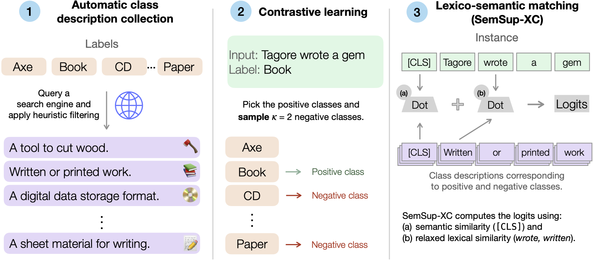

# SemSup-XC: Semantic Supervision for Extreme Classification

<p align="center">
  <a href="https://sites.google.com/view/semsup-xc/home/">Website</a> •
  <a href="https://arxiv.org/abs/2301.11309">Paper</a> 
</p>


<p align="center">
  <a href="https://huggingface.co/spaces/Pranjal2041/SemSup-XC">
        
  </a>
  <a href="https://github.com/princeton-nlp/semsup-xc/blob/master/LICENSE">
        
  </a>
  <a href="https://twitter.com/intent/tweet?text=Check%20out%20Semsup-XC%3A%20https%3A%2F%2Fgithub.com%2Fprinceton-nlp%2Fsemsup-xc">
  
  </a>      
</p>


<!-- <br> -->
[Pranjal Aggarwal](https://github.com/Pranjal2041), [Ameet Deshpande](https://ameet-1997.github.io/), [Karthik Narasimhan](https://www.cs.princeton.edu/~karthikn/)
<!-- <br> -->

## Abstract
>Extreme classification (XC) involves classifying over large numbers of classes (thousands to millions), with real-world applications like news article classification and e-commerce product tagging. The zero-shot version of this task requires generalization to novel classes without additional supervision, like a new class "fidget spinner" for e-commerce product tagging. In this paper, we develop SemSup-XC, a model that achieves state-of-the-art zero-shot (ZS) and few-shot (FS) performance on three XC datasets spanning the domains of law, e-commerce, and Wikipedia. SemSup-XC uses automatically collected semantic class descriptions to represent classes ("fidget spinner" can be described as "A spinning toy for stress relief") and enables better generalization through our proposed hybrid matching module (Relaxed-COIL) which matches input instances to class descriptions using both (1) semantic similarity and (2) lexical similarity over contextual representations of similar tokens. Trained with contrastive learning, SemSup-XC significantly outperforms baselines and establishes state-of-the-art performance on all three datasets, by 5-12 precision@1 points on zero-shot and >10 precision@1 points on few-shot (K = 1), with similar gains for recall@10. Our ablation studies highlight the relative importance of our hybrid matching module (upto 2 P@1 improvement on AmazonCat) and automatically collected class descriptions (upto 5 P@1 improvement on AmazonCat).
>




## Setup
First clone the repository and install dependencies:
```
git clone https://github.com/princeton-nlp/semsup-xc.git
pip install -r requirements.txt
```

Inside the `semsup-xc` folder, download pre-processed datasets and scraped class descriptions from [here](https://csciitd-my.sharepoint.com/:u:/g/personal/cs5190443_iitd_ac_in/EXIPIZqQEoxLtWF9efYC1IQBipua4PXWpWFWnO0NIZuzdg?e=ghYBfO). Unzip the downloaded file into datasets folder.

## Running

### Training
You need to run `python main.py <config_file> <output_dir>` to train both zero-shot and few-shot models on both datasets. See [configs](configs) folder for list of all relevant config files.

### Evaluation
For all datasets, you can directly run `main.py` script by updating config file by changing `pretrained_model` parameter and and setting `do_train` set to False. You can also adjust `random_sample` parameter to adjust the number of samples to evaluate on. 
For ensembling results with TF-IDF, use the `Evaluator.ipynb` script.
Previous method is slow, and memory hungry. For faster inference in Amazon and Wikipedia datasets, use:
`bash scripts/fastEval{DSET}.sh <config_file> <checkpoint_path>`.


## Trained Models
Pre-trained models can be downloaded from [here](https://csciitd-my.sharepoint.com/:u:/g/personal/cs5190443_iitd_ac_in/EQpMWyDrz7pLsEnuK6MFs_IBQLQpVzf6HUwYMOR1Iohcng?e=JRnbKR).

<h2 align="left" id="cite">Citing SemSup-XC</h2>


```bibtex
@article{aggarwal2023semsupxc,
  title   = {SemSup-XC: Semantic Supervision for Zero and Few-shot Extreme Classification},
  author  = {Pranjal Aggarwal and Ameet Deshpande and Karthik Narasimhan},
  year    = {2023},
  journal = {arXiv preprint arXiv: Arxiv-2301.11309}
}
```


## LICENSE

SemSup-XC is MIT licensed, as found in the [LICENSE](LICENSE) file.
